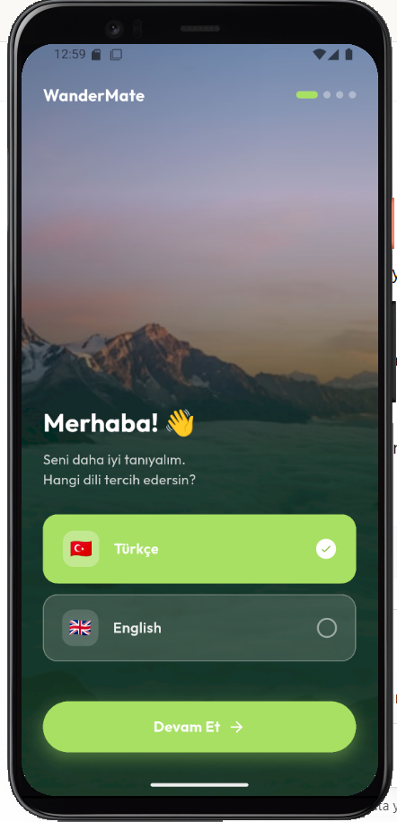
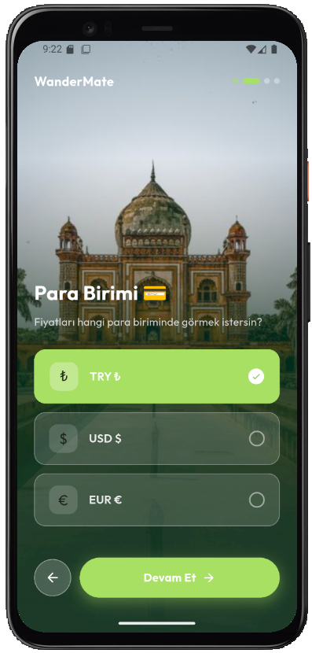
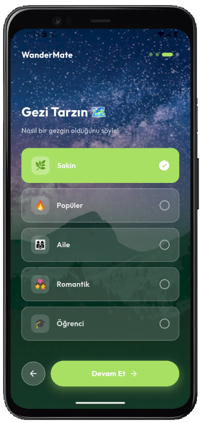
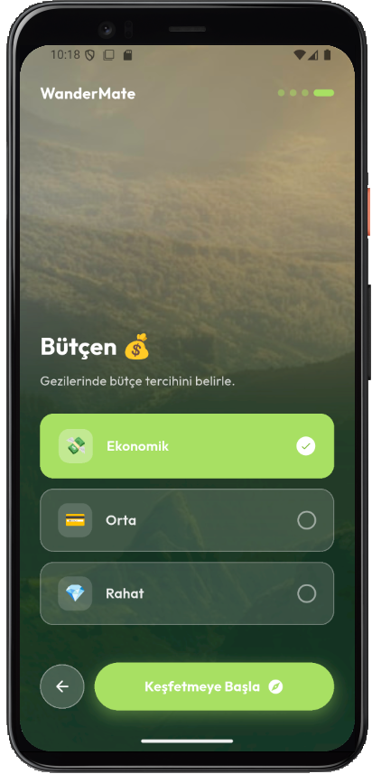
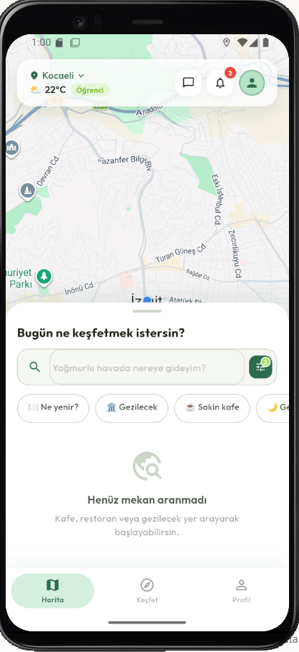
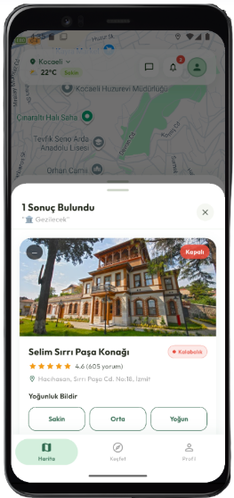
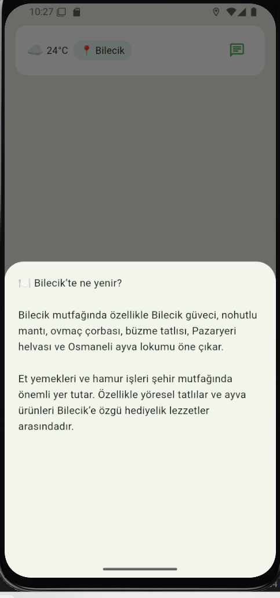
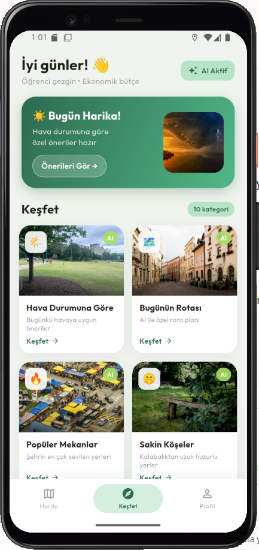

# 🧭 WanderMate

An AI-powered location-based travel assistant developed with Flutter.

WanderMate helps users discover nearby places using Google Maps, Google Places API, crowd density reporting, weather-aware suggestions, and Gemini AI-powered travel recommendations. The application combines location-based services and artificial intelligence to provide a personalized travel and exploration experience.

---

## ✨ Features

* 🗺️ Real-time location-based place discovery
* 📍 Google Maps and Google Places API integration
* 🤖 Gemini AI travel assistant
* 🔍 Smart search and query analysis
* 👥 Crowd density reporting system
* 🌤️ Weather-aware recommendations
* 🎯 Personalized onboarding and travel preferences
* 🏛️ Historical places and local attractions discovery
* 🍽️ Local food recommendations
* 📸 Photography spot suggestions

---

## 📱 Screenshots

### Onboarding Experience

| Language Selection                             | Currency Selection                             |
| ---------------------------------------------- | ---------------------------------------------- |
|  |  |

| Travel Style                             | Budget Selection                             |
| ---------------------------------------- | -------------------------------------------- |
|  |  |

### Home Map



### Place Detail & Crowd Reporting



### AI Recommendation



### Explore Screen




---

## 🛠️ Technologies

* Flutter 3.41.6
* Dart 3.11.4
* Google Maps API
* Google Places API
* Gemini API
* Riverpod
* SharedPreferences
* SQLite (sqflite)
* Geolocator
* Geocoding

---

## 🏗️ Project Structure

```text
lib/
├── constants/
├── core/
├── models/
├── presentation/
├── routes/
├── theme/
├── utils/
└── widgets/
```

---

## ⚙️ Configuration

For security reasons, API keys are not included in this repository.

Open:

```dart
lib/core/api_keys.dart
```

Replace the placeholder values with your own API keys:

```dart
class ApiKeys {
  static const String googleMapsApiKey = 'YOUR_GOOGLE_MAPS_API_KEY';
  static const String googlePlacesApiKey = 'YOUR_GOOGLE_PLACES_API_KEY';
  static const String geminiApiKey = 'YOUR_GEMINI_API_KEY';
}
```

Required APIs:

* Google Maps SDK
* Google Places API
* Google Geocoding API
* Gemini API

---

## 🚀 Installation

```bash
git clone https://github.com/dilara-sambur/WanderMate.git
cd WanderMate

flutter pub get
flutter run
```

---

## 🔒 Security

The application was analyzed using Mobile Security Framework (MobSF) to identify and address potential mobile security issues.

---

## 👩‍💻 Author

**Dilara Sambur**

Management Information Systems
Bilecik Şeyh Edebali University
